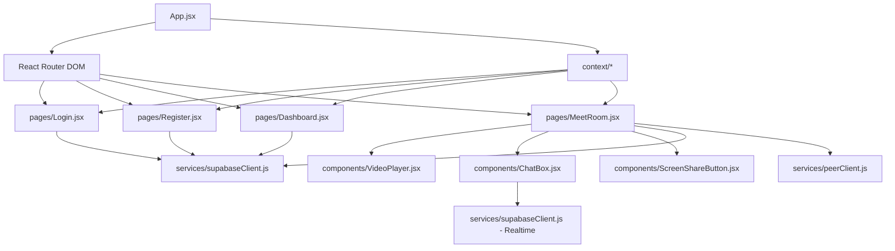

# Modèles Système : MiniMeet

## 🏛️ Architecture Système

L'application MiniMeet est une application web monopage (SPA) construite avec React.js pour le frontend. Elle communique avec Supabase pour l'authentification, la base de données en temps réel (pour le chat et la gestion des réunions) et le stockage (potentiellement pour les enregistrements, bien que l'enregistrement initial soit géré côté client via MediaRecorder API pour un téléchargement direct).

Les appels vidéo et le partage d'écran sont gérés en peer-to-peer (P2P) via la bibliothèque PeerJS, ce qui signifie que les flux médias sont échangés directement entre les navigateurs des participants après une phase initiale de signalisation (probablement orchestrée via Supabase ou un serveur PeerJS auto-hébergé/public).

## 🔑 Décisions Techniques Clés

*   **Frontend :** React.js avec Tailwind CSS pour un développement rapide d'interfaces utilisateur modernes et responsives.
*   **Backend & Base de Données :** Supabase est utilisé comme BaaS (Backend as a Service) pour gérer :
    *   Authentification des utilisateurs.
    *   Base de données PostgreSQL pour stocker les informations des réunions et les messages du chat.
    *   Fonctionnalités temps réel (Supabase Realtime) pour le chat.
*   **Communication P2P :** PeerJS pour les flux vidéo/audio et le partage d'écran, minimisant la charge serveur pour les médias.
*   **Enregistrement :** MediaRecorder API côté client pour l'enregistrement des sessions, permettant un téléchargement direct par l'utilisateur.
*   **Routing :** React Router DOM pour la navigation au sein de l'application SPA.

## 🧩 Modèles de Conception (Design Patterns) envisagés

*   **Composants Réutilisables (React) :** Structuration de l'interface utilisateur en composants modulaires et réutilisables (`VideoPlayer`, `ChatBox`, `ScreenShareButton`, etc.).
*   **Gestion d'état :** Utilisation du Context API de React ou d'une bibliothèque de gestion d'état (comme Zustand ou Redux Toolkit, à décider si le Context API devient insuffisant) pour gérer l'état global de l'application (utilisateur authentifié, état de la réunion, etc.).
*   **Services :** Séparation de la logique de communication avec les API externes (Supabase, PeerJS) dans des modules de service dédiés (`supabaseClient.js`, `peerClient.js`).
*   **Modèle Publication/Souscription :** Pour le chat en temps réel avec Supabase Realtime.

## 🔗 Relations entre Composants (basé sur l'arborescence fournie)

L'arborescence suggère une organisation modulaire :
*   `pages/` : Conteneurs de haut niveau pour chaque vue principale.
*   `components/` : Éléments d'interface réutilisables.
*   `services/` : Logique d'interaction avec les services externes.
*   `context/` : Gestion de l'état global partagé entre les composants. 